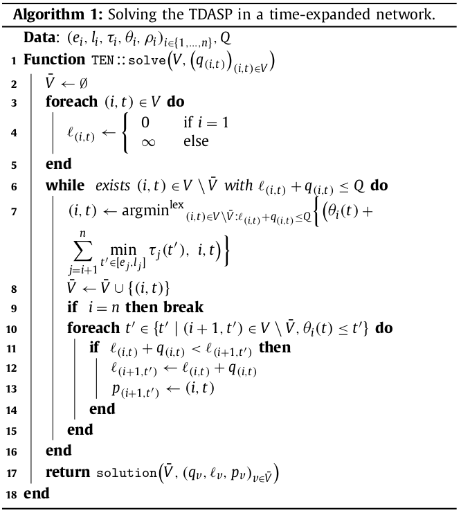

# TSDAP
## Time Dependent Activity Scheduling Problem

$\tau_i(t_i)$ is the time required to complete activity $i$ at time $t_i$.  
$e_i, l_i$ are the earliest start time and latest end time of activity $i$.  
$\rho_i(t_i)$ is the resource consumption of activity $i$ at time $t_i$.  
$Q$ is the total resource capacity  
$\theta_i(t_i) = t_i + \tau_i(t_i)$ is the completion time function.  

$$\min_{t_j} \theta_n(t_n) = \min_{t_j} t_n + \tau_n(t_n)$$

subject to

$$\theta_i(t_i) \le t_{i+1}$$
$$\sum_{i=1}^{n} \rho_i(t_i) \le Q$$
$$t_i \in [e_i, l_i]$$

We assume the FIFO property: $\theta_i(t) \le \theta_i(t')$ if $t \le t'$

## Solve TSDAP

$V_i = \{e_i, e_i + \epsilon, ..., l_i \}$ set of vertices for activity $i$  
$V = V_1 \cup ... \cup V_n$  
$q_{(i,t)} = \rho_i(t)$  
$l_{(i,t)}$ cumulative resource consumption prior to starting activity $i$ at time $t_i$.  
$W = \{(i, t) \in V \setminus \bar V \; | \; l_{(i, t)} + q_{(i,t)} \le Q\}$ set of still available vertices.

